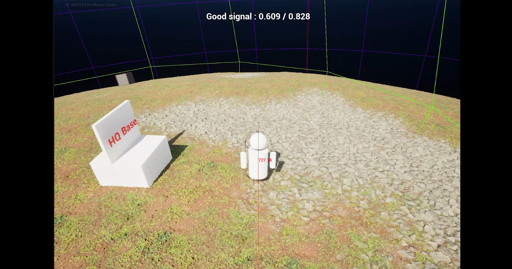
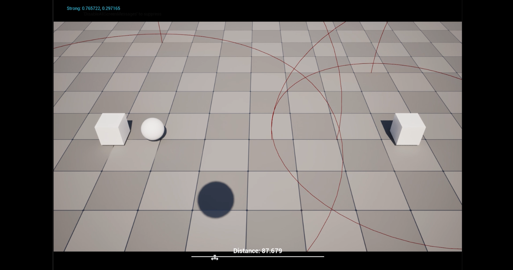

# Planet Project (UE5.5)

A solo-developed sandbox exploration game inspired by Astroneer and Outer Wilds.  
Focused on systemic gameplay, procedural worlds, and physics-driven interactions.

📅 Development started: February 20, 2026  
⚙️ Engine: Unreal Engine 5.5  
🎯 Focus: Gameplay Programming / Systems Design / Procedural Generation  

---

## Overview

This project is a long-term technical exploration of building a modular sandbox game with:
- spherical worlds (planet-based gameplay)
- custom gravity systems
- voxel terrain (Voxel Plugin 2.0)
- systemic interactions between gameplay components

The main goal is to design **scalable and reusable gameplay systems**, not just a playable prototype.

---

## Latest Development Progress

---

### 🪐 March 16, 2026 — Voxel Planet Integration

[▶ Watch Demo](https://youtu.be/pEuiPZgKgmw?si=xW_Hs3763l_jcww2)

**Summary**
- Integrated Voxel Plugin 2.0 into the project
- Created initial planet prototype with terrain generation
- Unified previously isolated systems into a single test environment

**Technical Notes**
- Focused on system composition rather than isolated prototypes
- Prepared foundation for terrain interaction and modification

**Next Steps**
- Implement terraforming tool for testing terrain interaction
- Validate performance and scalability of voxel setup

---

### 🌍 March 15, 2026 — Character Gravity Movement

[▶ Watch Demo](https://youtu.be/xbRxen8aRhs?si=GcUwqQ1tPIV_m3VL)

**Summary**
- Implemented custom character movement aligned to dynamic gravity sources
- Enabled movement on spherical surfaces

**Challenges**
- Rotation snapping when switching gravity attractors
- High-speed transitions cause unnatural orientation changes

**Planned Improvements**
- Smooth interpolation between gravity sources
- Conditional rotation logic based on velocity
- Extended testing across edge cases

---

### 🌐 March 13, 2026 — Planetary Gravity System (Chaos Physics)

[▶ Watch Demo](https://youtu.be/8Zs5AkZgMYs?si=TYFQ58QVBwfV2dXV)

**Summary**
- Implemented spherical gravity system using Chaos Physics callbacks
- Supports physics actors affected by planetary gravity

**Implementation Details**
- Based on Epic's Chaos callback approach:
  https://dev.epicgames.com/community/learning/tutorials/lydy/unreal-engine-using-chaos-callbacks-for-a-custom-gravity-system-working-with-round-worlds
- Refactored into a reusable and extensible system

**Challenges**
- Extremely high velocity near attractor origin
- Instability in edge cases close to gravity center

**Next Steps**
- Clamp velocity near attractor origin
- Introduce falloff function for gravity strength
- Stress testing with multiple attractors

---

### 📡 February 21, 2026 — HQ Signal System

[▶ Watch Demo](https://youtu.be/g0srvQBo0Rc?si=LOVJi3EMkopikrvG)

**Summary**
- Designed and implemented signal system with sources and receivers
- Signal strength depends on distance and attenuation

**Design Goals**
- Modular communication system for gameplay mechanics
- Scalable for large number of signal sources

**Challenges**
- Signal loss feels too abrupt
- Requires better smoothing for gameplay feel

**Next Steps**
- Add delay before signal loss (~5 seconds)
- Stress test with high number of sources (500+)

---

## Systems Breakdown

- Planetary Gravity System (Chaos-based)
- Character Movement on Spherical Worlds
- Voxel Terrain Integration
- Signal Communication System

---

## Development Philosophy

This project is built with focus on:
- modular architecture
- system-driven gameplay
- scalability and performance
- iterative prototyping

Each system is designed to be:
- reusable
- testable
- extensible

---

## Notes

- Voxel Plugin 2.0 is required (not included in repository)
- This is an active development project and systems are continuously evolving
