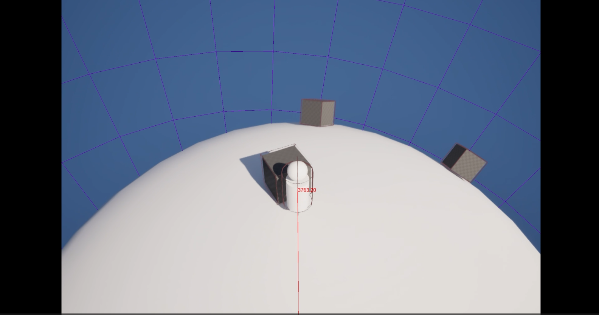
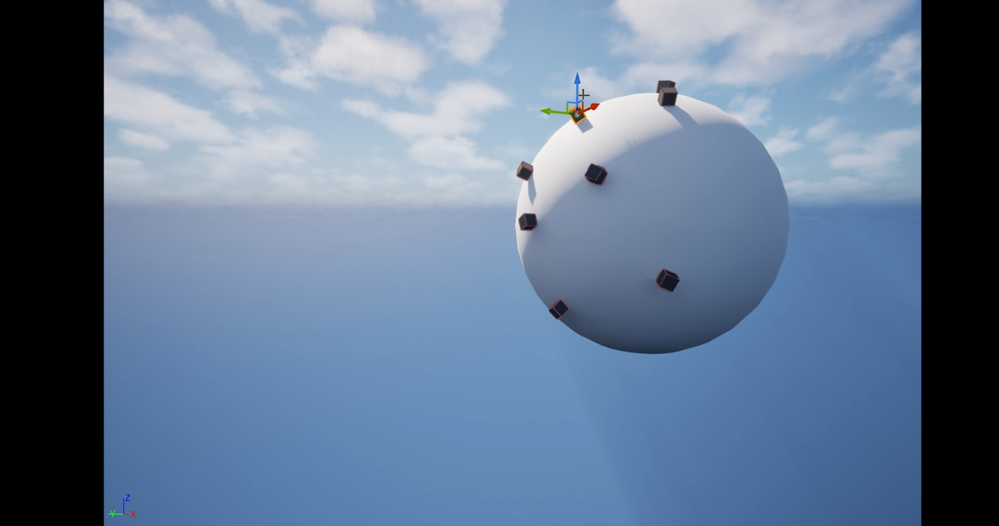

# Devlog — March 2026

---

## March 16, 2026 — Voxel Planet Integration

**Tags:** Voxel, World Generation  
**Video:** https://youtu.be/pEuiPZgKgmw?si=xW_Hs3763l_jcww2  
**Related Systems:** Gravity System

### Summary
Integrated Voxel Plugin 2.0 and created the first unified planet prototype.

### Next steps
- implement terraforming tool
- test terrain interaction pipeline
- evaluate performance

---

## March 15, 2026 — Character Gravity Movement

**Tags:** Physics, Movement, Gravity  
**Video:** https://youtu.be/xbRxen8aRhs?si=GcUwqQ1tPIV_m3VL  
**Related Systems:** Gravity System

### Summary
Implemented character movement aligned with dynamic gravity sources.

### Next steps
- smooth interpolation between gravity sources
- velocity-based rotation logic

---

## March 13, 2026 — Planetary Gravity System (Chaos Physics)

**Tags:** Physics, Chaos, Gravity, Core System  
**Video:** https://youtu.be/8Zs5AkZgMYs?si=TYFQ58QVBwfV2dXV  
**Related Systems:** Gravity System

### Summary
Implemented a spherical gravity system using Chaos Physics callbacks.

### Next steps
- clamp velocity near origin
- implement gravity falloff function
- stress testing with multiple attractors
