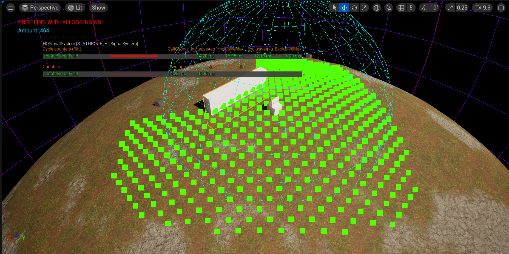
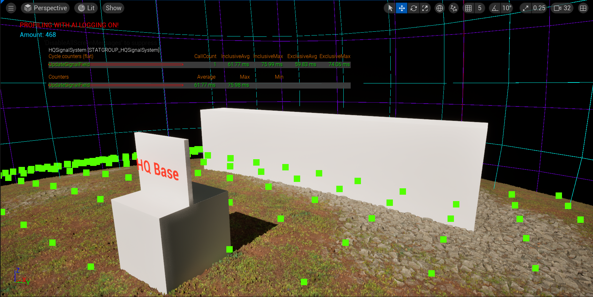
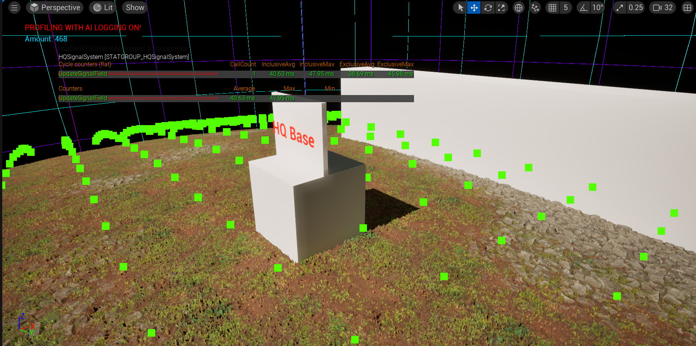
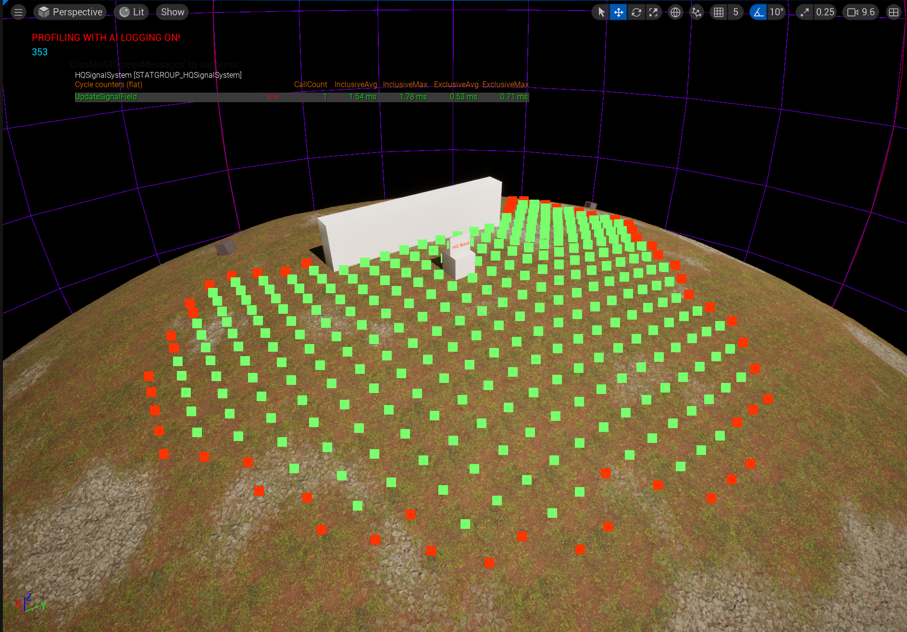
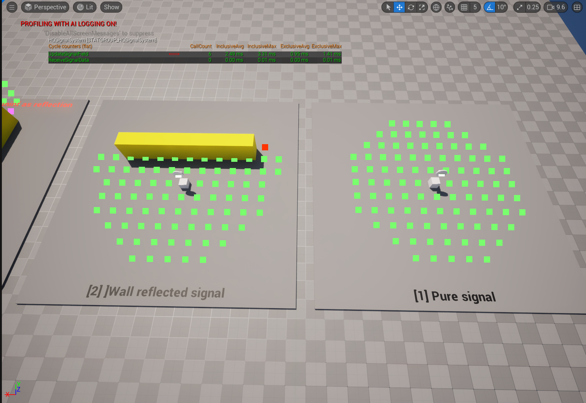
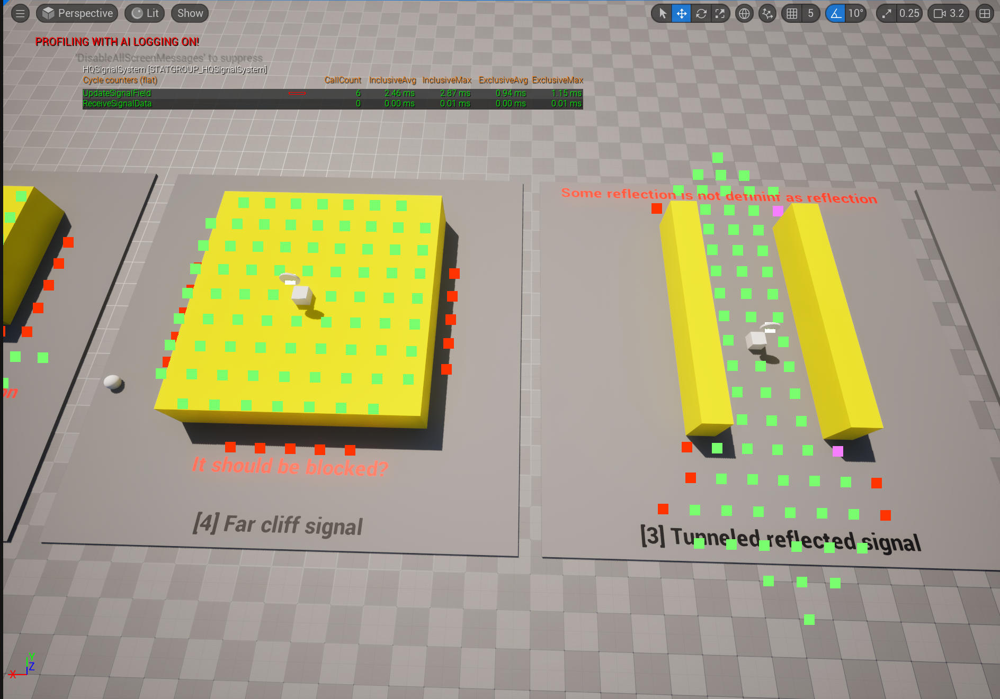
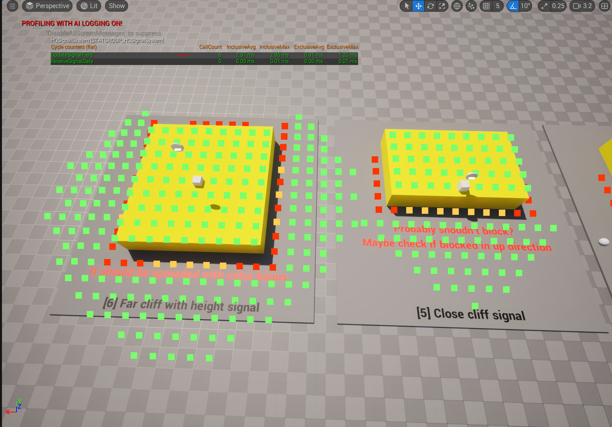

# Devlog - April 2026

---

## April 14, 2026 - Redesign signal field strength

**Video:** https://youtu.be/RXv0JBYXTt8 https://youtu.be/-NlApun-mIs

**Related Systems:** HQ Signal System

### Summary
First prototype of new signal field spreading was created. Now by gamplay idea signal not only spreading in radius but it can react on obstacles, to reflect signal to other sides
or signal could not be spread behind the obstacles. Implemented finding signal strength for receiver by converting its world location to local XY srouce coordinates.
It is steal prototype but it optimized from ~60ms to ~16ms

### Next steps
- Continue optimize the algorithm
- Optimize find signal strength algorithm
- Implement increase signal spreading based on height of source compare to ground
- Made visual grid in gameplay showing signal boundries

---

## April 16, 2026 - Update signal field algorithm

**Related Systems:** HQ Signal System

### Summary
At first I optimize previous solution from ~16ms to ~2ms. Based of optimized solution, I refactor some code, fix the spreading problem in the air and add new cliffed cell type
Which enhance my signal if anteen(source signal actor) stand on some cliff and also it more spreding if signal source (component) is hiegher in local coordinate (inside the actor).
These new updates give player opportunity to place antennas on height ground to receive better signal quality, and also they can upgrade antenas make them higher and signal will spreading futher.

### Next steps
- Continue optimize the algorithm but in low prioriy
- Make some refactor of current algoritm, prepare it for ability to upgrade the signal sources
- Made visual grid in gameplay showing signal boundries
